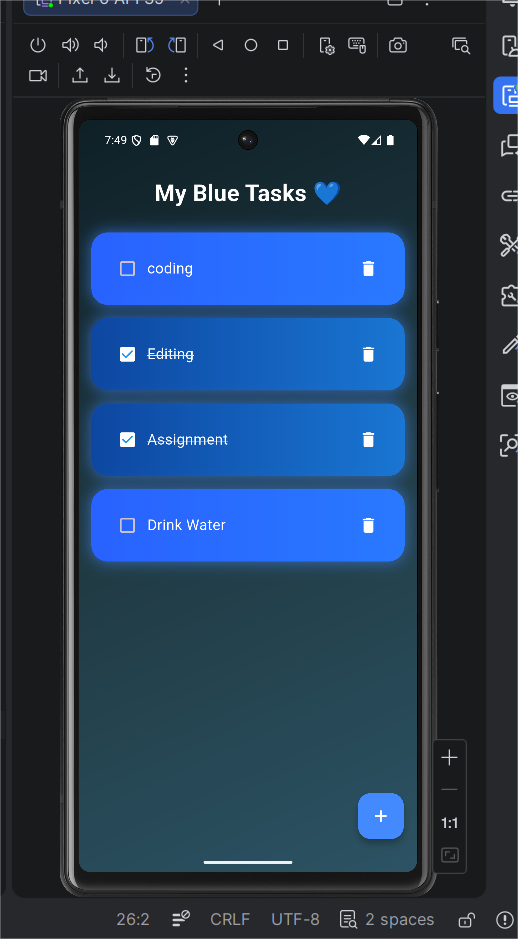
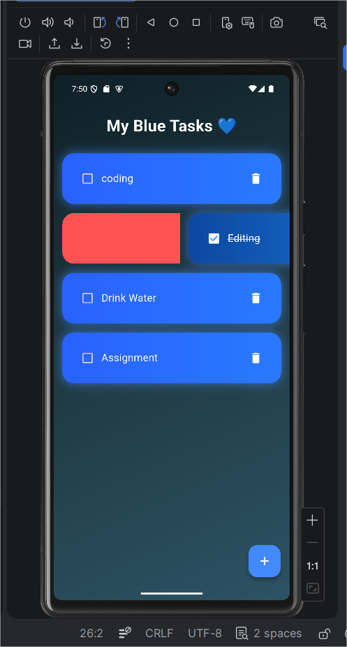
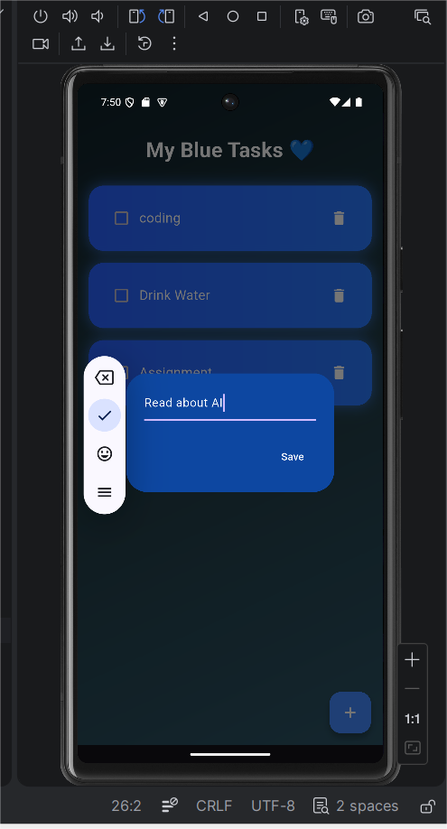

# my_app
# 💙 Blue_ToDo_App

A modern and minimal Blue-themed To-Do application built using Flutter.
This project was developed as part of my Flutter internship to demonstrate clean UI design, task management functionality, and GitHub workflow.

## ✨ Features

- Add new tasks  
- Edit existing tasks  
- Delete tasks  
- Swipe to remove  
- Smooth animations  
- Clean blue UI theme  

## 📸 Screenshots

<p align="center">
  
  
  
</p>

## 🛠 Tech Stack

- Flutter  
- Dart  
- Material Design  
- Git & GitHub  

## 🚀 Getting Started

```bash
git clone https://github.com/AndreaCaro08/blue_todo_app.git
cd blue_todo_app
flutter pub get
flutter run
